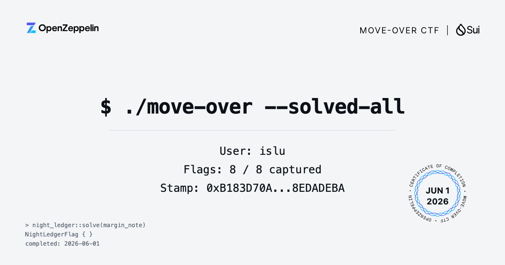

+++
date = '2026-06-01T20:06:24+08:00'
draft = false
title = 'Move Over CTF Writeup'
author = 'islu'
summary = 'OpenZeppelin Sui Move 安全 CTF，記錄 8 個關卡的漏洞成因與防範方式'
keywords = ['smart contract security', 'security', 'vulnerability']
categories = ['Writeup']
tags = ['sui', 'move', 'ctf']

[cover]
image = "images/move-over-website.png"
alt = "move-over-website"
caption = "Move-over Website"
relative = false
hiddenInList = true
hiddenInSingle = false
+++

[Move Over](https://www.moveoverapp.com/) 是 OpenZeppelin 推出的 Sui Move 安全 CTF，目前共 8 個關卡，這篇是通關後整理的筆記，記漏洞成因和開發上的注意事項，不是完整解題流程

---

## Level 1 – Artifact

暖身關，鑄造 Artifact，充能到 100 後呼叫 `shatter()` 拿旗標

```move
public fun shatter(artifact: Artifact): ArtifactFlag {
    let Artifact { id, power } = artifact;
    assert!(power == 100, 0);
    id.delete();
    ArtifactFlag {}
}
```

這關本身沒有漏洞，主要熟悉 Move 的 Resource 生命週期——建立、修改、消耗，Move 保證 Resource 不可複製、不會意外遺失，`shatter()` 透過解構 `Artifact` 來消耗它，是 Move 中正確銷毀資源的方式

## Level 2 – Coin Collector

從自動販賣機取得 Prize，看到 `buy_prize` 第一眼就注意到問題了：

```move
public fun buy_prize(payment: Token): CoinCollectorFlag {
    let Token { id, value: _ } = payment;  // value 直接被丟掉
    id.delete();
    CoinCollectorFlag {}
}
```

解構時 `value: _` 直接忽略金額，只要有任何 Token 就能買，不管裡面是多少，`faucet()` 給的 Token 可以用 `split(0)` 拆出一個零值 Token，用那個就過了

Move 保證資產不能被偽造，但不保證商業規則正確，缺少金額驗證在 DeFi 合約裡很常見，正確的寫法：

```move
assert!(payment.value() >= PRICE, EInsufficientPayment);
```

## Level 3 – Sticky Treasure

從 Chest 中取出 Prize（value = 1000），Chest 建立時把 Prize 存進 Dynamic Field[^1]，一種讓 Object 在執行時動態新增或移除鍵值對的機制，不需要在結構定義時宣告所有欄位：

```move
public fun create(ctx: &mut TxContext): Chest {
    let mut chest = Chest { id: object::new(ctx) };
    df::add(&mut chest.id, b"prize", Prize { value: 1000 });
    chest
}
```

乍看 `smash()` 像是正確的取出方式，但實際上是個陷阱：

```move
public fun smash(chest: Chest): Prize {
    let Chest { id } = chest;
    id.delete();
    Prize { value: 0 }  // 回傳假的 Prize，Dynamic Field 裡的才是真的
}
```

`smash()` 刪掉了 Chest 的 UID，但回傳的是新建的 `Prize { value: 0 }`，真正的 Prize 還留在 Dynamic Field 裡，正確做法是 `extract_prize()`，透過 `df::remove` 把 Prize 真正移出來：

```move
public fun extract_prize(chest: &mut Chest): Prize {
    df::remove(&mut chest.id, b"prize")
}
```

Dynamic Field 不會因為 parent 被刪就自動清空，存進去的資料要明確 `remove`，否則容易出現幽靈資產

## Level 4 – Flash Vault

耗盡 Flash Vault 的所有資金（初始 1000），這關用了 Flash Loan 搭配 Hot Potato Pattern

Hot Potato 是一種沒有 `drop` ability 的 struct，建立後必須在同一筆交易內被消耗，否則交易失敗[^2]，Flash Loan[^3] 常靠這個確保借款一定要還——`borrow()` 產生 Receipt（Hot Potato），必須在交易結束前呼叫 `repay()` 消耗它

但 `cancel()` 的實作有問題：

```move
public fun cancel(vault: &mut FlashVault, receipt: Receipt, ctx: &TxContext) {
    let Receipt { vault_id, borrower, nonce, amount: _ } = receipt;  // amount 被忽略
    assert!(vault_id == object::id(vault), EWRONG_VAULT);
    assert!(borrower == ctx.sender(), EWRONG_BORROWER);
    assert!(nonce + 1 == vault.next_nonce, ENONCE_MISMATCH);
    // Receipt 消失了，但借出的錢完全沒有還回去
}
```

Receipt 被正確驗證後銷毀，`vault.balance` 卻沒有恢復，借出的資金就留在借款人手中，Hot Potato 的保護點不是 Receipt 存在，而是**銷毀 Receipt 必須跟還款綁定**，只驗證合法性、忘了驗證還款，保護就失效了

## Level 5 – Pool Party

耗盡 Pool A（Treasury，餘額 100,000）的流動性，系統有三個 Pool（A/B/C），用 Receipt 追蹤借款，問題在 `repay()` 的參數設計：

```move
public fun repay(
    pool: &mut Pool,         // 要還款的 Pool（誰接收資金）
    receipt_pool_id: ID,     // 呼叫者自行傳入
    receipt: Receipt,
    repayment: u64,
    ctx: &TxContext,
) {
    let Receipt { pool_id, borrower, nonce, amount } = receipt;
    assert!(pool_id == receipt_pool_id, EINVALID_POOL_ID);  // 只比對呼叫者傳的 ID
    assert!(nonce + 1 == pool.next_nonce, ENONCE_MISMATCH);  // nonce 對的是當前 pool
    pool.balance = pool.balance + repayment;  // 錢進了當前 pool
}
```

Receipt 的 `pool_id` 只跟呼叫者自行傳入的 `receipt_pool_id` 比對，完全沒有跟正在操作的 `pool` 比較，這讓 Pool A 的 Receipt 可以拿去還 Pool C 的款，Pool A 的資金就這樣流失了

Sui 裡 Object ID 才是真正的身分識別[^4]，正確做法應該驗證 Receipt 和當前 Pool 是否來自同一個物件：

```move
assert!(receipt.pool_id == object::id(pool), EInvalidReceipt);
```

只比對欄位值而不驗證物件本身，就可能出現跨物件混用

## Level 6 – Tick Tock

從流動性池提取大量資金（Token Balance 降至 100,000 以下），問題在 `add_liquidity` 的成本計算

Move 沒有浮點數，DeFi 協議通常用 Fixed Point Arithmetic[^5] 搭配整數模擬小數——用固定的 scale factor 做縮放，需要特別注意除法截斷和溢位邊界：

```move
const SCALE: u128 = 1 << 64;

public fun tick_to_sqrt_price(tick: u64): u128 {
    let shift = (tick / 100) as u8;
    1u128 << shift  // tick = 0 → sqrt_price = 1
}

public fun add_liquidity(..., liquidity_amount: u128, tick: u64, ...) {
    let sqrt_price = tick_to_sqrt_price(tick);
    let cost = (liquidity_amount * sqrt_price) / SCALE;
    assert!((deposit as u128) >= cost, 0);
}
```

`SCALE = 2^64`，當 `tick = 0` 時 `sqrt_price = 1`：

```
cost = (liquidity_amount * 1) / 2^64
```

只要 `liquidity_amount < 2^64`，cost 就被整數截斷為 0，等於用 0 deposit 拿到大量流動性份額，再透過 `remove_liquidity` 幾乎提空整個池子

常見的防法是先乘後除、設最小成本，或提高 Fixed Point 精度

## Level 7 – Mailbox

取得原本寄給 ADMIN（`0xAD3171`）的信件，信件的取出有兩種方式，其中 `claim_via` 接受 `RelayHandle` 作為身分證明

這邊用的是 Capability Pattern[^6] 用一個只有授權方才能持有的 struct 作為權限憑證，比直接驗證 sender address 更具擴展性：

```move
public fun claim_via(office: &mut PostOffice, letter_id: ID, handle: &RelayHandle): Letter {
    assert!(letter.addressee == mailbox_relay::target(handle), EWRONG_RECIPIENT);
    letter
}
```

設計方向沒問題，但 `RelayHandle` 的發放毫無限制：

```move
public fun handle_for(target: address, ctx: &mut TxContext): RelayHandle {
    RelayHandle { id: object::new(ctx), target }
    // 完全沒有驗證 ctx.sender() == target
}
```

任何人都可以替任意地址建立 Handle，Capability Pattern 的前提是只有授權方才能持有，這裡的持有門檻是零，等於形同虛設，正確做法：

```move
assert!(ctx.sender() == target, EUnauthorized);
```

## Level 8 – Night Ledger

用 1 單位的 Margin 取得 value ≥ 10,000,000 的 MarginNote，開倉時用 `checked_shlw` 計算所需保證金，這個函式的 Overflow 檢查有 bug

看 codebase 裡其實同時存在兩個版本：

```move
// 實際使用的（有 bug）
pub fun checked_shlw(n: u128): (u128, bool) {
    let mask = 0xffffffffu128 << HIGH_BITS_OFFSET;  // HIGH_BITS_OFFSET = 96
    if (n > mask) { (0, true) }  // mask = 2^128 - 2^96，幾乎不可能觸發
    else { (n << SHIFT_BITS, false) }  // SHIFT_BITS = 32
}

// 正確版本（在 codebase 裡也有，但沒被使用）
pub fun checked_shlw_strict(n: u128): (u128, bool) {
    let limit = 1u128 << HIGH_BITS_OFFSET;  // 2^96
    if (n >= limit) { (0, true) }  // 正確邊界
    else { (n << SHIFT_BITS, false) }
}
```

`mask = 0xffffffff << 96 = 2^128 - 2^96`，真正應該攔截的是 `n >= 2^96`（超過就左移 32 位元會溢位），但 buggy 版本只攔截 `n > 2^128 - 2^96`，中間 `[2^96, 2^128 - 2^96]` 這一大段全漏掉了

特定的 liquidity 值繞過 Overflow 檢查後，計算出的保證金因為整數溢位縮至極小，關倉時透過 `payout_from_liquidity` 換出遠超預期的金額：

```move
pub fun payout_from_liquidity(liquidity: u128, shift: u8): u64 {
    let scaled = (liquidity >> shift) as u64;  // shift = 28
    if (scaled == 0) { 1 } else { scaled }
}
```

自行實作數學函式比想像中危險，尤其是位元運算和 Fixed Point 計算，能用經過審計的函式庫就優先選用，必須自己寫的話 Fuzz Testing 和完整邊界測試不可少

## Completion



## Ref.

[^1]: [Sui - Dynamic Field](https://docs.sui.io/concepts/dynamic-fields)

[^2]: [Pattern: Hot Potato](https://move-book.com/programmability/hot-potato-pattern.html)

[^3]: [Pattern: Hot Potato - Flash Loans](https://move-book.com/programmability/hot-potato-pattern.html#flash-loans)

[^4]: [Sui - Object Model](https://docs.sui.io/concepts/object-model)

[^5]: [Fixed Point Arithmetic](https://en.wikipedia.org/wiki/Fixed-point_arithmetic)

[^6]: [Pattern: Capability](https://move-book.com/programmability/capability.html)
